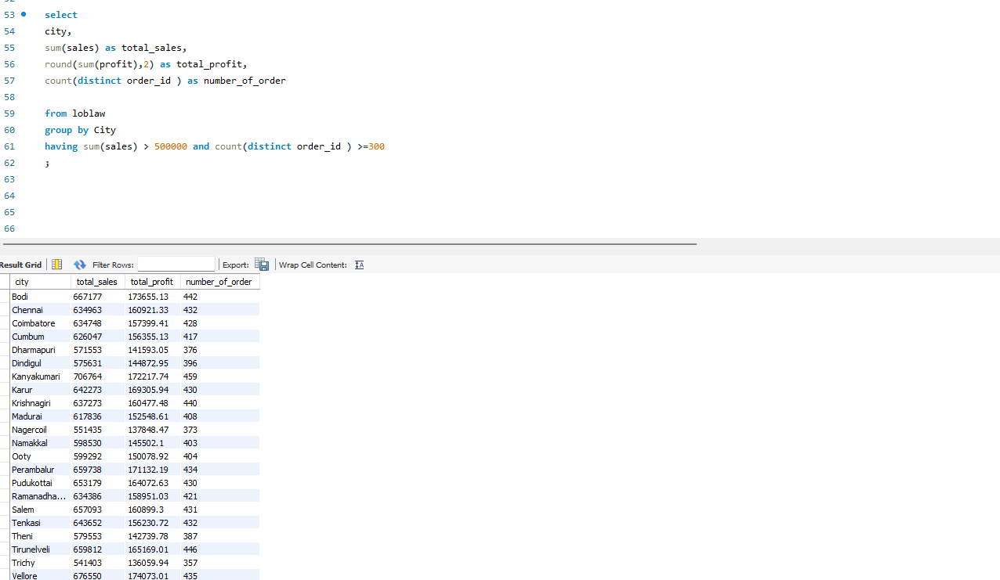
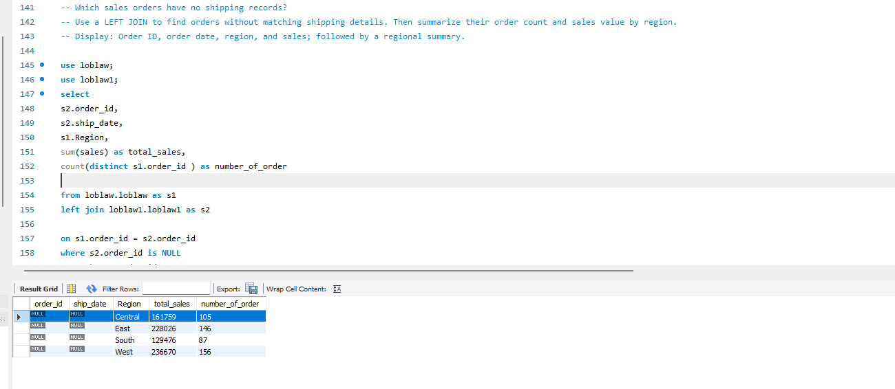
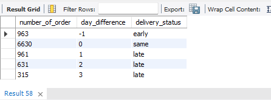
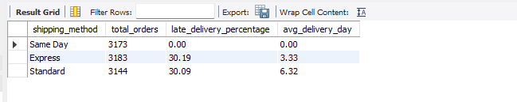
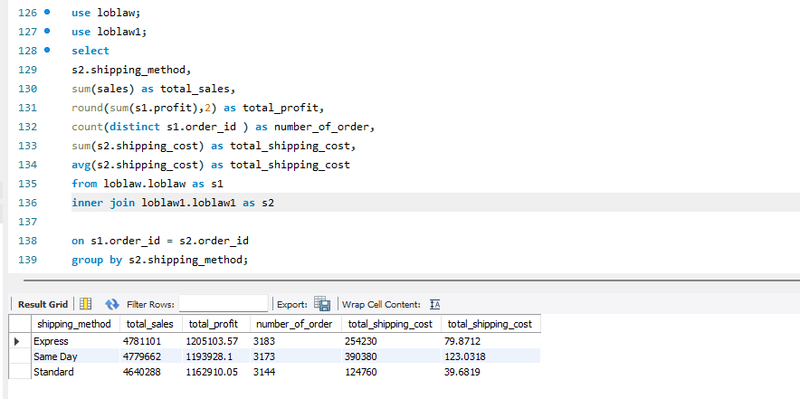

📊 Retail Sales and Shipping Insights — SQL Project
Using MySQL to analyze sales performance, identify delivery delays, and uncover opportunities to improve retail operations.
---

## 📌 Project Background

This project uses SQL to analyze grocery sales, profitability, and delivery performance. It combines sales and shipping data to identify strong-performing categories, compare delivery methods, and investigate orders with missing shipping records.

The analysis covers 9,994 sales orders from 2015 to 2018. Of these, 9,500 have matching shipping records.

**Tools:** MySQL 8+ and MySQL Workbench.

**Main business question:** How is the business performing, and where should it focus its improvement efforts?

---

## 🎯 Project Objectives

- Measure sales, recorded profit, order volume, and average order value.
- Compare category, subcategory, and city performance.
- Join sales and shipping data to evaluate delivery costs and reliability.
- Identify orders without matching shipping records.
- Use subqueries and window functions to explore order values and rankings.
- Present supported findings and practical business recommendations.

---

## 📊 Summary of Results

| Business measure | Result |
| --- | ---: |
| Total sales | 14,956,982.00 |
| Total recorded profit | 3,747,121.20 |
| Total orders | 9,994 |
| Average order value | 1,496.60 |
| Profit margin | 25.05% |
| Orders without shipping records | 494 |
| Late deliveries | 1,907 |
| Late-delivery rate among matched orders | 20.07% |

The analysis identifies three main areas for review: category profitability, missing shipping records, and delivery reliability. Express and Standard shipping both have late-delivery rates of approximately 30%, although Express is faster on average and costs more.

Amounts are shown in the dataset's monetary units because its currency is not specified.

---

## 📂 Datasets

| File | Records | Information included |
| --- | ---: | --- |
| `Loblaw.csv` | 9,994 | Order ID, customer name, category, subcategory, location, order date, sales, discount, and profit |
| `loblaw1.csv` | 9,500 | Order ID, order date, shipping method, shipping cost, payment method, and delivery dates |

The tables are connected using `order_id`. Order IDs are unique in both files, so each matched sales order connects to one shipping record. Every shipping record has a matching sales order.

This is an educational grocery retail project. The filenames do not establish an affiliation with Loblaw Companies Limited; the sales data contains locations in Tamil Nadu.

---

## 🗂️ Business Questions

| Analysis | Business Question | SQL Techniques |
| --- | --- | --- |
| Business overview | What are total sales, profit, orders, average order value, and margin? | `SUM`, `COUNT(DISTINCT)` |
| Category performance | Which categories and subcategories lead sales and profit? | `GROUP BY`, `ORDER BY` |
| City performance | Which cities exceed the sales and order thresholds? | `GROUP BY`, `HAVING` |
| Time trends | How does activity vary by month and within the latest 30 days? | Date functions, CTEs, subqueries |
| Shipping comparison | How do shipping costs and delivery times differ? | `INNER JOIN`, `AVG`, `DATEDIFF` |
| Missing records | Which sales orders have no shipping record? | `LEFT JOIN`, `IS NULL` |
| Delivery status | How many orders are early, on time, or late? | `CASE WHEN`, aggregation |
| Order value | Which late orders have above-average sales? | Joins, subqueries |
| Ranking | What are the latest orders and highest sales values? | `ROW_NUMBER`, `RANK`, `DENSE_RANK` |

---

## 🔧 SQL Techniques

| Method | Application in the project |
| --- | --- |
| `SELECT`, `WHERE`, `ORDER BY`, `LIMIT` | Explore records and filter orders by sales, discount, and delivery conditions |
| `SUM`, `AVG`, `COUNT(DISTINCT)` | Calculate business totals and averages |
| `GROUP BY`, `HAVING` | Compare categories and locations and filter aggregated results |
| `INNER JOIN` | Connect sales orders with shipping details |
| `LEFT JOIN`, `IS NULL` | Identify sales orders without shipping records |
| `CASE WHEN` | Classify deliveries and flag late orders |
| Date functions | Convert date text, measure delivery time, and define reporting periods |
| Subqueries and CTEs | Organize calculations and compare order values with averages |
| `ROW_NUMBER`, `RANK`, `DENSE_RANK` | Select recent orders and rank sales values |

---

## 🔎 Analysis and Query Results

### 1. Sales and profitability

Calculate overall sales, profit, orders, average order value, and margin.

**Purpose:** Establish a baseline for evaluating business performance.

The dataset contains **14.96 million in sales** and **3.75 million in recorded profit**, producing a **25.05% profit margin**. Average order value is **1,496.60**.

These measures provide a baseline for comparing categories, locations, and shipping activity. Recorded profit is used as provided; its definition does not establish a net profit measure.

---

### 2. Leading categories and subcategories

Compare sales and profit across categories, subcategories, and cities.

**Purpose:** Identify strong-performing areas for a more detailed business review.

| Area | Leading result |
| --- | --- |
| Category sales | Eggs, Meat & Fish: 2,267,401.00 |
| Category profit | Snacks: 568,178.85 |
| Subcategory sales | Health Drinks: 1,051,439.00 |
| Subcategory profit | Health Drinks: 267,469.79 |
| City sales | Kanyakumari: 706,764.00 across 459 orders |

Eggs, Meat & Fish generates the highest category sales, while Snacks contributes the most category profit. This shows why sales and profit should be reviewed together when evaluating performance.

Health Drinks leads both sales and profit among subcategories. Within Bakery, Breads & Buns generates more sales and profit than Biscuits or Cakes.

**Query result: city sales analysis**

---

### 3. Missing shipping records

Use a LEFT JOIN to identify unmatched orders and summarize them by region.

**Purpose:** Check data completeness and prioritize record reconciliation.

A total of **494 sales orders**, representing **4.94% of all orders**, have no matching shipping record. These orders account for **755,931.00 in sales**.

| Region | Orders without shipping records | Associated sales |
| --- | ---: | ---: |
| West | 156 | 236,670.00 |
| East | 146 | 228,026.00 |
| Central | 105 | 161,759.00 |
| South | 87 | 129,476.00 |
| **Total** | **494** | **755,931.00** |

West and East have the largest numbers of unmatched orders. These counts help prioritize record checks, but they do not measure each region's missing-record rate.

A missing shipping record does not prove that an order was undelivered. Possible explanations include incomplete data or a different fulfillment process.

**Query result: missing shipping records by region**

The shipping-side order ID and ship date are NULL because these sales orders have no matching shipping record.

---

### 4. Delivery reliability

Classify deliveries by comparing actual and expected delivery dates.

**Purpose:** Measure how consistently orders meet the promised delivery date.

Of the 9,500 orders with shipping records, **1,907 arrived after their expected delivery date**.

| Delivery status | Orders | Percentage |
| --- | ---: | ---: |
| Early | 963 | 10.14% |
| On time | 6,630 | 69.79% |
| Late | 1,907 | 20.07% |
| **Total** | **9,500** | **100.00%** |

Among late deliveries, 961 were one day late, 631 were two days late, and 315 were three days late. Delivery performance excludes the 494 orders without shipping records.

**Query result: delivery status by day difference**

The screenshot separates late orders by the number of days late; the table above combines them. The label `same` means delivered on the expected date.

---

### 5. Shipping speed and cost

Compare average shipping cost, delivery time, and late-delivery rate by method.

**Purpose:** Evaluate delivery speed and reliability alongside cost.

| Shipping method | Orders | Average shipping cost | Average delivery time in days | Late-delivery rate |
| --- | ---: | ---: | ---: | ---: |
| Express | 3,183 | 79.87 | 3.33 | 30.19% |
| Same Day | 3,173 | 123.03 | 0.00 | 0.00% |
| Standard | 3,144 | 39.68 | 6.32 | 30.09% |

Express arrives faster than Standard on average and costs approximately twice as much. However, both methods have similar rates of missing their promised delivery dates.

Same Day has no recorded late deliveries and the highest average shipping cost. This result applies to the practice dataset; it does not establish that changing shipping methods would produce the same outcome in a real business.

**Query result: shipping performance**

---

### 6. Sales associated with each shipping method

Join the datasets and calculate sales, recorded profit, and shipping cost by method.

**Purpose:** Understand the sales volume and cost associated with each delivery option.

| Shipping method | Sales | Recorded profit | Total shipping cost |
| --- | ---: | ---: | ---: |
| Express | 4,781,101.00 | 1,205,103.57 | 254,230.00 |
| Same Day | 4,779,662.00 | 1,193,928.10 | 390,380.00 |
| Standard | 4,640,288.00 | 1,162,910.05 | 124,760.00 |
| **Total** | **14,201,051.00** | **3,561,941.72** | **769,370.00** |

Express and Same Day handle similar sales volumes, but Same Day has a higher total shipping cost. Shipping decisions should therefore consider delivery speed, service reliability, and cost together.

Sales from matched orders total **14,201,051.00**. Adding the **755,931.00** associated with unmatched orders gives the full sales total of **14,956,982.00**.

**Query result: sales and shipping cost comparison**

In this screenshot, the final column contains average shipping cost, although its displayed alias repeats `total_shipping_cost`.

---

## 💡 Business Recommendations

1. **Review missing shipping records.** Start with West and East, which have the largest unmatched order counts. Establish a regular check between sales and shipping records using order ID.
2. **Investigate delivery delays.** Review Express and Standard orders by location and period. Compare shipping and delivery dates to understand where delays occur.
3. **Evaluate shipping costs alongside service.** Assess whether faster shipping provides enough value to justify its higher cost before changing shipping policies.
4. **Use both sales and profit for category planning.** Review strong categories and subcategories alongside demand and product availability before changing inventory or promotions.

---

## 📐 Metric Definitions

| Measure | Calculation |
| --- | --- |
| Average order value | Total sales ÷ distinct order count |
| Profit margin | Total profit ÷ total sales × 100 |
| Late-delivery rate | Late matched orders ÷ all matched orders × 100 |
| Delivery time | Actual delivery date − order date |

Findings use the query-result screenshots in `Loblaws.doc`, checked against the supplied CSV files. Overall sales, profit, and order totals are combined from the seven category rows. Profit margins are calculated from sales and profit totals. Delivery status counts combine the displayed day-difference groups.

---

## 🔍 Scope and Limitations

- Sales dates contain mixed formats. The supplied monthly and recent-period outputs do not cover all valid dates, so this report does not identify a strongest month or present a complete 30-day sales result.
- The higher-value late-order screenshot shows only part of the output and uses an average based on matched orders. It does not support a count of above-average orders across the full sales dataset.
- Customer names are not verified unique customer identifiers. Customer rankings and latest-order results refer to groups sharing the same name.
- Shipping costs are kept separate from profit because the dataset does not explain whether recorded profit already includes shipping.
- The shipping data's origin and generation method are not documented in the files. Findings describe this practice dataset.

---

## 🔄 Project Workflow

1. **Import the data:** Load both CSV files into MySQL.
2. **Review the structure:** Check order identifiers, date formats, and numeric fields.
3. **Connect the datasets:** Join sales and shipping records using order ID.
4. **Write business queries:** Apply filtering, aggregation, conditional logic, subqueries, and window functions.
5. **Interpret the results:** Compare performance and distinguish supported findings from incomplete outputs.
6. **Document the analysis:** Present business questions, findings, recommendations, and query screenshots.

---

## 🛠️ Tools and Technologies

- **MySQL 8+:** Database and SQL query execution.
- **MySQL Workbench:** Query development and result inspection.
- **CSV:** Source data format.
- **Markdown:** Project documentation.
- **GitHub:** Intended publication platform for the portfolio project.

---

## 🚀 Getting Started

1. Import the CSV files into MySQL 8+.
2. Use `loblaw.loblaw` for sales and `loblaw1.loblaw1` for shipping, or adjust table names in the queries.
3. Rename the sales CSV's `Order ID` column to `order_id` if using the submitted query names.
4. Confirm numeric data types and normalize sales dates before date-based analysis. Import shipping dates as `DATE`.
5. Run the SQL analysis and compare the outputs with the report's supported findings.
6. Upload `README.md` and the complete `images` folder to the repository root. Keep the image filenames and folder name unchanged so the screenshots display correctly. Add the SQL script alongside them.

---

## 📌 Project Purpose

This project demonstrates joining related datasets, building business metrics, checking data completeness, using subqueries and window functions, and translating results into practical recommendations. It also shows the importance of checking calculation definitions and data coverage before reporting business conclusions.

---

## 👤 Author

**Mohammad**  
B.Sc. in Computer Science, Data Science concentration — Ontario Tech University

